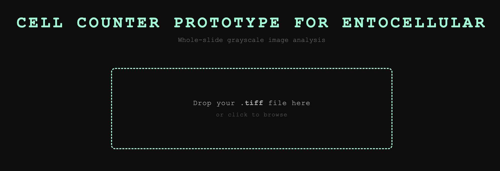
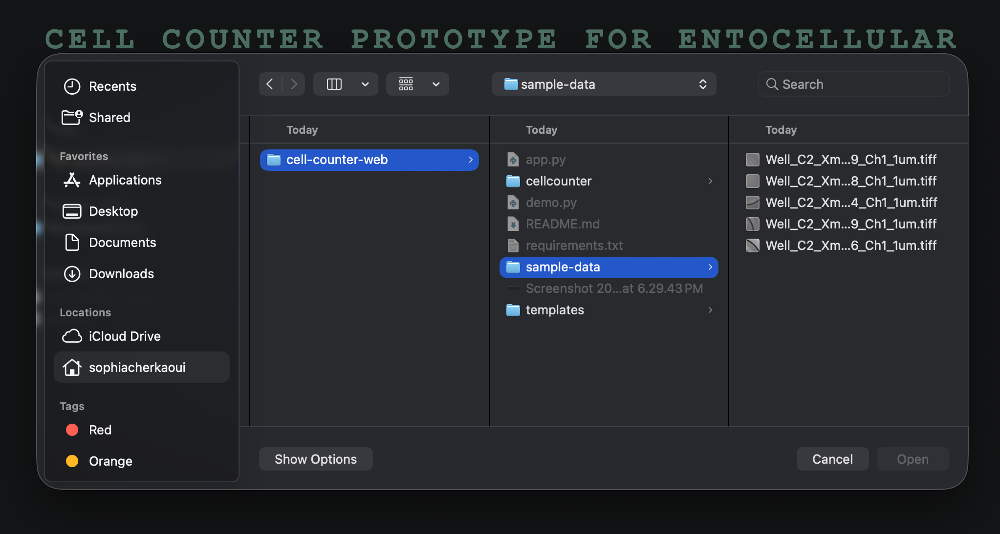
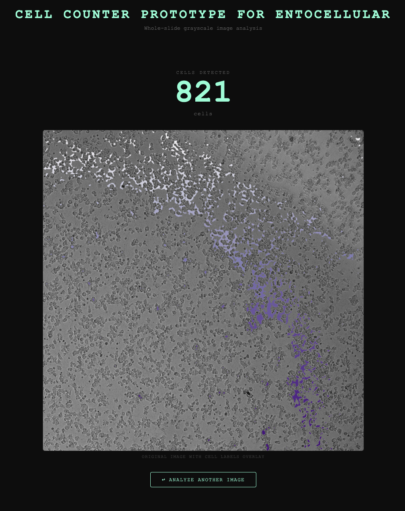

# entocellular prototype
A prototype for a package API and web tool for counting cells in whole-slide images for Entocellular's ML project.

### 1. Web tool for counting cells
a tool for just dropping .tiff images and getting the number of cells in the image. meant for visualization mainly.

    
### 2. Package `cellcounter` (starter API -- to be built out in future work)
eventually, this could be expanded to support various methods for counting cells (not just those provided in Mahotas) as well as different display methods.

### API usage
`git clone https://github.com/soph743/entocellular-prototype`

`cd entocellular-prototype`

`pip install -r requirements.txt`

`python demo.py`

### Web app usage
this app is currently not deployed publicly.

### API usage
`git clone https://github.com/soph743/entocellular-prototype`

`cd entocellular-prototype`

`pip install -r requirements.txt`

`python demo.py`

### Web app usage
this app is currently not deployed publicly.

home page

upload screen (can also drag and drop)

analysis of image upload

